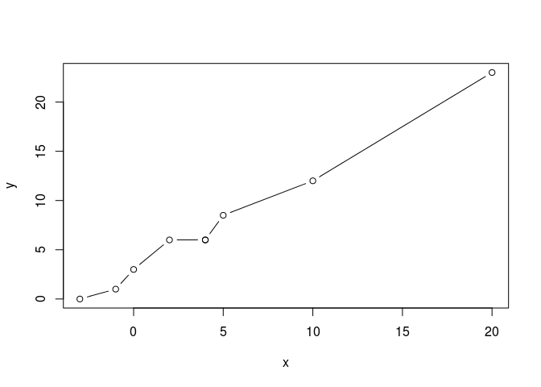
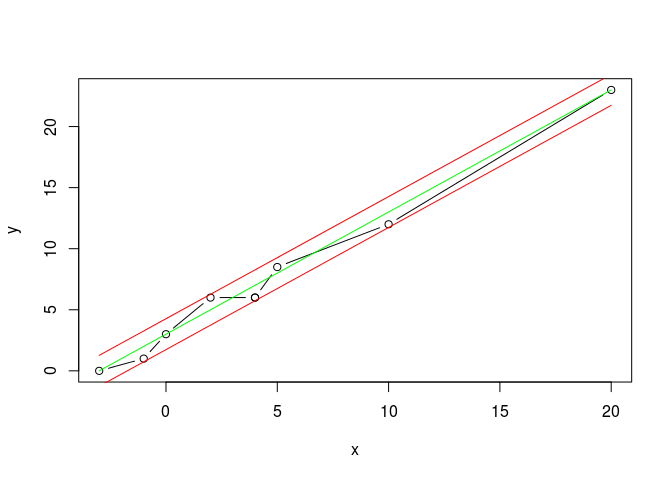

# Test Scenario 1
pparacch  
03. nov. 2015  

##Assumption
All of the vertices passed to the algorithm are under the provided distance (`distance` threshold).

##Outcome
The list of vertices is reduced to two vertex only, the first and the last vertex.

```r
x <-c(-3.0,-1.0, 0.0, 2.0, 4.0, 4.0, 5.0, 10.0, 20.0)
y <- c(0.0, 1.0, 3.0, 6.0, 6.0, 6.0, 8.5, 12.0, 23.0)

#Simplified curve based on details below
x_s <-c(-3.0,20.0)
y_s <- c(0.0,23.0)
plot(x, y, type="b", col="black")
lines(x_s, y_s, type= "b", col="green")
```

 

##Visualization
The vertices and their curve. 

```r
distance <- 1.0

x <-c(-3.0,-1.0, 0.0, 2.0, 4.0, 4.0, 5.0, 10.0, 20.0)
y <- c(0.0, 1.0, 3.0, 6.0, 6.0, 6.0, 8.5, 12.0, 23.0)
plot(x, y, type="b", col = "black")
```

 


Drawing the line between the first and last vertex in the provided list, and the 2 parallel lines located at `+/- distance`

```r
line_1 <- x + 3 # y = m x + b
#Let's find the perpendicolar line and make it pass from a Point (xp, yp) in line1
# y = (-1/m) (x - xp) + yp

#Using line1 and its points, lets calculate the angle alpha between the line1 and x-axis
#Points: -3,0 and 20, 23
delta_x <- 20 + 3
delta_y <- 0 + 23
ref_x <- distance * cos(90 - (atan2(delta_y,delta_x)))
ref_y <- distance * sin(90 - (atan2(delta_y,delta_x)))

line_1_plus_threshold <- (x - (-3 - ref_x)) + ref_y
line_1_minu_threshold <- (x - (-3 + ref_x)) - ref_y
```


```r
plot(x, y, type="b")
lines(x, line_1, col="green")
lines(x, line_1_plus_threshold, col="red")
lines(x, line_1_minu_threshold, col="red")
```

 

As we can see all of the verices are within the `+/- threshold` - so the curve can be reduced to a line between the first and last point of the provided vertices.
